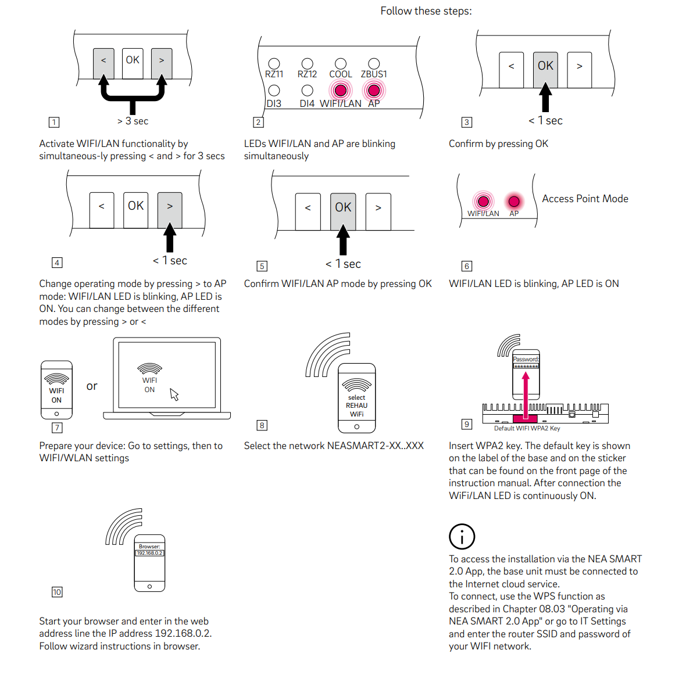

# Connecting Home Assistant to a REHAU NEA SMART 2 — Beginner Guide

This guide walks you through connecting your REHAU NEA SMART 2 underfloor heating/cooling controller to Home Assistant, step by step. No prior networking experience needed — every tricky bit is explained.

---

## Before you start — read this

This integration works by switching the NEA SMART 2 into **Access Point (AP) mode**. The device then talks directly to Home Assistant on its own private Wi-Fi network, with no internet involvement.

### ⚠️ What you will lose

- **The official NEA SMART 2 app stops working.** As long as the device is in AP mode, the app cannot reach it. This is permanent for as long as you use this integration.
- **All cloud features go away** (remote access via the REHAU servers, push notifications from the app, etc.). Home Assistant can replace all of these.

If you are not okay giving up the official app, **stop here**. You cannot use both at the same time.

### ✅ What you gain

- Full local control of every heating/cooling zone from Home Assistant.
- Automations, dashboards, voice control, energy tracking — anything HA can do.
- Your data never leaves your home.
- REHAU cannot push firmware updates, disable features, or change anything on the device. It has no internet connection, so it's frozen in time — and yours.

---

## What you need

- A **REHAU NEA SMART 2** controller, installed and powered on.
- A working **Home Assistant** install. This guide assumes **Home Assistant OS** running on a Raspberry Pi, mini PC, or similar — the most common setup. If you run HA Container or Core on a regular Linux machine, the steps are the same but you configure the network at the OS level instead of in the HA UI.
- The **Mosquitto broker** add-on installed in Home Assistant (we'll set this up in Step 7 if you don't have it — it's free, takes 30 seconds).
- A **USB Wi-Fi dongle** that works with Home Assistant OS / Linux. Cheap dongles around €10–15 based on Realtek RTL8188/RTL8192 chipsets work well. Before you buy, search for "Home Assistant USB Wi-Fi dongle" to confirm compatibility.
- A few minutes of physical access to the NEA SMART 2 to press buttons.
- The **serial number** of the NEA SMART 2, printed on a sticker on the underside of the device. You'll only need the first 8 characters.

---

## How the connection works

You are going to put Home Assistant in a position where it lives on **two networks at the same time**:

| Adapter | Connects to | Purpose |
|---|---|---|
| Existing adapter (built-in Wi-Fi or Ethernet) | Your home router | Internet, normal HA usage, all other integrations |
| New USB Wi-Fi dongle | NEA SMART 2's private Wi-Fi | Talks only to the heating controller — no internet |

This is the key idea. Home Assistant's normal connection to the internet **does not change**. We are only adding a second adapter, dedicated to the NEA SMART 2.

Getting this right is the only really tricky part of the whole setup. Step 4 covers it in detail.

---

## Step 1 — Put the NEA SMART 2 in AP mode

This step happens on the device, not in Home Assistant.

The button sequence from the official REHAU manual:

<p align="center">
  
</p>

What the sequence does, in plain words:

1. Stand in front of the NEA SMART 2.
2. **Hold `OK + AP` for ~3 seconds.** The WiFi/WLAN and AP LEDs start blinking.
3. **Press `OK` again** to confirm. AP mode is now active: the WLAN LED stays ON, AP LED stays ON.
4. The device starts broadcasting its own Wi-Fi network — SSID looks like `NEASMART2-XX-XXX` (the suffix is part of its MAC address).
5. The Wi-Fi password is the **first 8 characters of the device's WLAN MAC address, without the colons**. You'll find that MAC printed in the manual / on a sticker, or shown on the device screen under Settings.
6. Once joined, the setup page is at <http://192.168.0.2>.

> **Important: the Ethernet port on the NEA SMART 2 is disabled in AP mode.** Wi-Fi is the only way to reach it. Don't try to use a cable — it won't work.
>
> *Image © REHAU — reproduced here for instructional purposes; consult the official NEA SMART 2.0 manual (Chapter 08.03 "Operating in AP mode") for the authoritative version and per-firmware variations.*

---

## Step 2 — Plug in the USB Wi-Fi dongle

1. **Shut down Home Assistant** properly (Settings → System → top-right ⋮ → Shut down).
2. Once it's off, plug the USB Wi-Fi dongle into a free USB port on your HA machine.
3. Power Home Assistant back on.
4. Wait 2–3 minutes for it to finish booting.

---

## Step 3 — Check that Home Assistant sees the dongle

1. In Home Assistant, go to **Settings → System → Network**.
2. You should now see **two network interfaces** listed.
   - Your existing one is usually `eth0` (if wired) or `wlan0` (built-in Wi-Fi).
   - The new dongle is usually `wlan1`.
3. If you only see one interface, your dongle isn't supported. Reboot once and check again. If it's still missing, try a different dongle — not all USB Wi-Fi adapters work on Linux out of the box.

---

## Step 4 — Connect the dongle to the NEA SMART 2 (the critical step)

This is the only step you really need to get right. Done wrong, Home Assistant will lose internet access. Done right, everything just works.

1. In **Settings → System → Network**, click on the new Wi-Fi adapter (`wlan1`).
2. Choose to connect to the NEA SMART 2's Wi-Fi network (`NEASMART2-XXXXXX`). The **default Wi-Fi key** is printed in two places: on the **label on the base of the device**, and on a **sticker on the front page of the instruction manual**. Either one works.
3. When the connection settings appear, **switch to manual IP configuration** and enter exactly these values:

| Field | Value |
|---|---|
| IPv4 method | **Static** (not DHCP / not automatic) |
| IP address | `192.168.0.10` |
| Netmask / prefix | `255.255.255.0` (or `/24`) |
| Gateway | **leave empty** |
| DNS servers | **leave empty** |

4. Save.

### Why these exact settings matter

The NEA SMART 2 has a built-in DHCP server. If you let it assign an address automatically, it works — but it also tells your dongle "I am your gateway to the internet." Your dongle then competes with your existing adapter for handling internet traffic, and **traffic gets routed through the NEA SMART 2, which has no internet**. Result: dashboards break, integrations fail, automations stop.

Two things prevent this:

- **Static IP `192.168.0.10`**: a fixed, predictable address that won't change. The NEA SMART 2 itself lives at `192.168.0.2`, so `.10` keeps you safely out of its way.
- **No gateway, no DNS**: tells Home Assistant "use this adapter **only** to talk to devices on `192.168.0.x`. For everything else, keep using the existing adapter." Your normal internet access is preserved.

---

## Step 5 — Verify everything still works

After saving the configuration:

- **Look at the NEA SMART 2 itself.** Once the dongle is successfully connected, the **Wi-Fi / LAN LED on the device stays continuously ON** (no blinking). That's your visual confirmation that the link is up.
- Open your Home Assistant dashboard the usual way. It should load normally.
- Check that cloud-based integrations still work (weather, voice assistant, etc.).
- *(Optional, advanced)* From the **Terminal & SSH** add-on inside Home Assistant, run `ping 192.168.0.2`. You should get replies. This is the only place from which the NEA is reachable — see Step 6 for why.

If your Home Assistant lost internet access, the gateway field was set by mistake. Go back to Step 4, edit the adapter, and make sure **Gateway** and **DNS** are completely empty.

If the Wi-Fi / LAN LED on the NEA SMART 2 is **off or blinking**, the dongle never finished associating with the device — check the Wi-Fi password (it must match the one on the device label / manual sticker exactly) and try connecting again.

---

## Step 6 — Understanding what you just built (important)

This is an explanation step, not an action step. Read it once — it'll save you a lot of confusion later.

### Only Home Assistant can talk to the NEA SMART 2

From now on, **the only device on your network that can reach the NEA SMART 2 is Home Assistant itself**. Your phone, your laptop, your tablet — none of them can open `http://192.168.0.2` in a browser, even when they're connected to the same home Wi-Fi as Home Assistant.

Why? Because the path to the NEA SMART 2 goes through the USB Wi-Fi dongle plugged into Home Assistant. Your other devices have no idea that network exists. Your home router doesn't either. There's no route — by design.

This is not a problem. It's exactly what we want:

- It keeps the NEA SMART 2 isolated and secure.
- It prevents random devices on your home network from accidentally messing with the heating.
- It means REHAU's network — which has no internet access — stays cleanly separated from everything else.

**You will interact with the NEA SMART 2 only through Home Assistant**, never directly. The add-on we install in Step 7 takes care of all the communication for you.

### About the installer code (you'll need it in Step 7)

The add-on needs to authenticate with the NEA SMART 2. The credential is the same one we mentioned in Step 4:

- The **first 8 characters of the serial number**, printed on the sticker on the bottom of the device.
- (The device also shows this as the "Unique Code" if you navigate to that screen on the NEA SMART 2 itself.)

Write it down somewhere safe — you'll paste it into the add-on configuration in a moment.

### You do *not* need to log in manually

There's no "log into the NEA web interface and click around" step. The Betterehau add-on connects to the NEA SMART 2 for you, scrapes everything it needs, and exposes it cleanly to Home Assistant. If you're curious to see the raw device UI later, you can reach it from the Home Assistant **Terminal & SSH** add-on with a text-mode browser (`lynx http://192.168.0.2`) — but for normal use, you'll never need to.

---

## Step 7 — Install the Betterehau add-on

This integration is shipped as a Home Assistant **add-on**, not an HACS integration. It runs as a small background service alongside HA: it polls the NEA SMART 2, publishes everything to Home Assistant via MQTT, and bundles a nice web UI.

Repository: [`github.com/manuxio/rehau-nea-smart-2-home-assistant`](https://github.com/manuxio/rehau-nea-smart-2-home-assistant)

### 7a — Install the Mosquitto broker (if you don't have it)

The add-on uses MQTT to communicate with Home Assistant. If you've never installed an MQTT broker before:

1. Go to **Settings → Add-ons → Add-on Store**.
2. Search for **Mosquitto broker** (the official Home Assistant add-on).
3. Click **Install**, then **Start**.

That's it — defaults are fine, no configuration needed.

### 7b — Add the Betterehau repository to Home Assistant

1. Go to **Settings → Add-ons → Add-on Store**.
2. Click the three-dot menu (**⋮**) in the top-right corner.
3. Choose **Repositories**.
4. Paste this URL:

   ```
   https://github.com/manuxio/rehau-nea-smart-2-home-assistant
   ```

5. Click **Add**, then **Close**.

> 💡 **Shortcut:** the project's GitHub README has a one-click **Add to Home Assistant** badge that does this step for you.

### 7c — Install the add-on

1. Refresh the Add-on Store page (pull-to-refresh on mobile, or scroll down).
2. You'll see a new section called **REHAU Nea Smart 2** near the bottom of the store.
3. Click **REHAU Nea Smart 2 Bridge (local)**.
4. Click **Install** and wait a minute or two for it to download.

### 7d — Configure the add-on

1. Once installed, open the **Configuration** tab of the add-on.
2. Set these three fields at minimum:

| Field | Value |
|---|---|
| `device_url` | `http://192.168.0.2` |
| `device_installer_code` | the **first 8 characters of the NEA SMART 2 serial number** (same code you used in Step 6 — also visible on the device's *Unique Code* page) |
| `installation_name` | any short label you like, e.g. `Casa`, `Home`, `Apartment` — this becomes the HA device name |

3. **Leave the MQTT fields empty.** The add-on will auto-detect the Mosquitto broker you installed in Step 7a. Only fill them in if you use a separate, external MQTT broker.
4. Click **Save**.

### 7e — Start the add-on

1. Go to the **Info** tab of the add-on.
2. Toggle on **Start on boot**, **Watchdog**, and **Show in sidebar** (recommended).
3. Click **Start**.
4. Open the **Log** tab and watch for ~30 seconds. You should see lines confirming the connection to the NEA SMART 2 and the MQTT discovery messages being published. If you see `ConnectTimeout` errors, see the troubleshooting section below.

### 7f — Verify in Home Assistant

Go to **Settings → Devices & Services**. You should now see a single new device (named after your `installation_name`) with:

- One **climate** entity per heating/cooling zone in your home
- A **humidity sensor** per zone
- **Operating mode** and **energy level** selectors at the system level
- **Alarm** binary sensors and various **diagnostic** entities

You'll also see a new **REHAU** entry in the Home Assistant sidebar — that's the bundled web UI, with dashboards, room dials, program editors, and installer controls. It auto-logs you in when accessed through Home Assistant, and works as an installable PWA on your phone (open `http://<your-ha-host>:8080/` in a mobile browser and "Add to Home Screen").

---

## Step 8 — Enjoy

You can now:

- Add the zones to your dashboards.
- Build automations (e.g. "cool the bedroom to 21 °C 30 minutes before bedtime", "turn everything off when no one is home").
- Control the heating with voice assistants.
- Track energy/temperature trends over time.

---

## Troubleshooting

**My internet stopped working after configuring the dongle.**
You set a gateway by mistake. Go to **Settings → System → Network → wlan1**, edit IPv4 settings, and make sure **Gateway** and **DNS** are empty. Save.

**The dongle doesn't appear in HA's network settings.**
Reboot once. If it's still missing, your USB Wi-Fi adapter isn't supported by Home Assistant OS. Try a different one with a known-compatible chipset.

**I can't open `http://192.168.0.2` in my browser.**
Make sure `wlan1` is actually connected to the NEA SMART 2 Wi-Fi (check signal/connected status in Settings → System → Network). From the HA terminal add-on, run `ping 192.168.0.2`. If it doesn't reply, the Wi-Fi link is down — try reconnecting.

**Can I use an Ethernet cable to the NEA SMART 2 instead of a Wi-Fi dongle?**
No. In AP mode the Ethernet port on the NEA SMART 2 is disabled. Wi-Fi is the only option.

**I forgot the installer password.**
It's printed under the device. The first 8 characters of the serial number on the sticker.

**I want to use the official app again.**
Take the NEA SMART 2 out of AP mode (same button combo as Step 1, on the device). This will break this integration but restore the official app. You can't have both.

**The add-on starts but no rooms show up in Home Assistant.**
The bridge can't reach the NEA SMART 2. Open the add-on's **Log** tab — it will print the exact URL it tried. Make sure `device_url` is `http://192.168.0.2` and that you can open that URL in a browser from the HA host (Step 5).

**The add-on log shows `ConnectTimeout` errors.**
The NEA SMART 2 has a small network buffer and can choke on rapid-fire requests. Open the add-on's **Configuration** tab and raise `device_min_gap_ms` from `150` to `250` or `400`. Save and restart the add-on.

**MQTT entities don't appear in Home Assistant.**
Make sure the **Mosquitto broker** add-on (Step 7a) is installed *and started*. The Betterehau add-on auto-discovers it, but only if it's running. Check the Betterehau log for a line containing `mqtt connecting` followed by `ha discovery published`.

**Does my existing Wi-Fi need to be on the `192.168.0.x` range?**
It should **not** be on `192.168.0.x` — that's the NEA SMART 2's network. Your home network is almost certainly on `192.168.1.x` or similar, which is fine. If by coincidence your home router uses `192.168.0.x`, change it (or change the NEA SMART 2's subnet inside its admin UI) — otherwise the two networks will collide.

---

## A note on safety and ongoing maintenance

This is an unofficial integration. REHAU does not endorse, support, or know about it. By using it you accept that:

- You are responsible for your own heating system.
- Updating Home Assistant or HACS as usual is fine — it won't affect the NEA SMART 2.
- The NEA SMART 2 firmware is frozen at whatever version it had when you put it in AP mode. Because it has no internet, REHAU cannot push changes — good for stability, but also means no bug fixes from them.

That's the trade. For most users, a device that just works forever and is 100% under their control is worth a lot more than a vendor app.

Enjoy your independence. 🛠️
