# REHAU Nea Smart 2 — Home Assistant add-ons

Local, cloud-free Home Assistant integration for the **REHAU Nea Smart 2.0**
heating / cooling base station. Talks straight to the device on the LAN
(HTTP scrape) and re-publishes everything as MQTT discovery entities plus a
clean web UI served via HA ingress.

> **v6.0.0 is a complete rewrite.** The previous releases used the REHAU
> cloud (Playwright login, e-mail 2FA, OAuth2). This version drops all of
> that — it speaks HTTP directly to the base station. No e-mail, no 2FA,
> no third-party servers, no rate limits, no privacy surface.

[](https://my.home-assistant.io/redirect/supervisor_add_addon_repository/?repository_url=https%3A//github.com/manuxio/rehau-nea-smart-2-home-assistant)

> ⚡ **No Home Assistant? No add-on? No problem.** There's now a standalone
> **firmware** for the Olimex ESP32-POE that becomes the whole integration on
> its own — REST API, MQTT + HA Discovery, and a resident web app served
> straight from the board, fully local. See **[`FIRMWARE.md`](FIRMWARE.md)**.

> 📘 **First time here?** Read [`INSTALL.md`](INSTALL.md) — a step-by-step,
> beginner-friendly walkthrough that covers switching the REHAU base
> station into Access Point (Wi-Fi) mode, joining your Home Assistant host
> to it, and installing the add-on. Every networking detail is explained
> from scratch.

---

## Screenshots

### In Home Assistant

Once the add-on is installed and started, HA discovers a single
MQTT device with all the entities — climate per room, system selects,
sensors, switches, diagnostics — populated from the live state of the
REHAU base station.

<p align="center">
  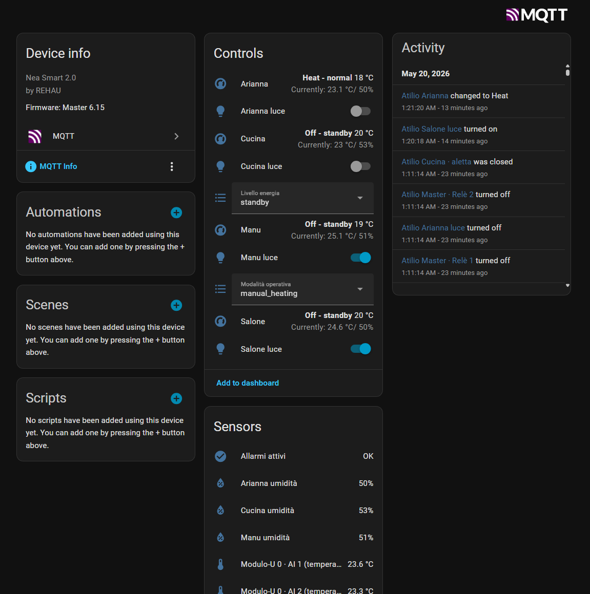
</p>

### In the bundled Web UI (mobile)

The bundled web UI is mobile-first — installable as a PWA from any
browser, themed for dark / light, EN + IT. Every shot below comes
straight from the running SPA against a real REHAU base station on
the LAN — no mocks, no Photoshop, just headless-Chromium + a CSS
phone frame.

<table>
  <tr>
    <td align="center" width="50%">
      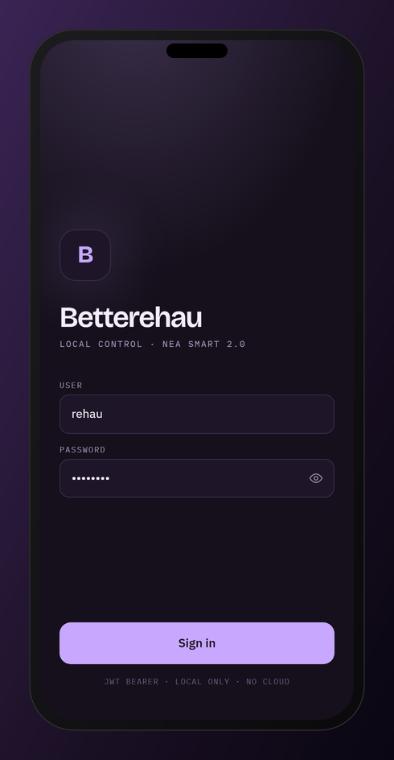<br/>
      <sub><b>Login</b> — JWT-bearer, local-only. No e-mail, no cloud, no 2FA. Under HA ingress the form is skipped entirely: the bridge reads <code>X-Ingress-Path</code> and hands the SPA a token automatically.</sub>
    </td>
    <td align="center" width="50%">
      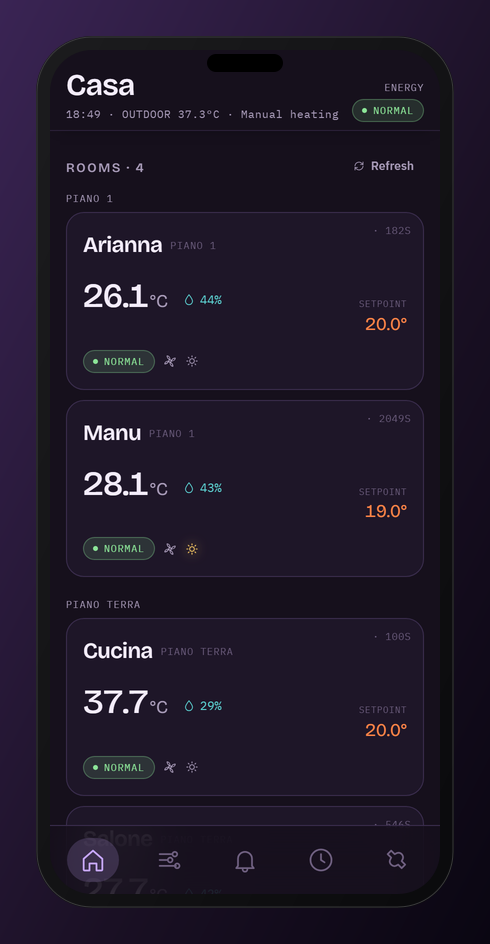<br/>
      <sub><b>Dashboard</b> — rooms grouped by floor, live temperature and humidity, current mode pill, and the active setpoint. Scenes (one-tap mode + setpoint roll-outs) sit at the top.</sub>
    </td>
  </tr>
  <tr>
    <td align="center" width="50%">
      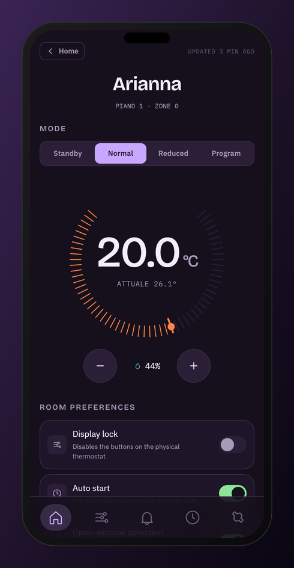<br/>
      <sub><b>Room — mode + setpoint</b> — segmented mode chooser drives a radial dial. Writes are optimistic on the bridge: the new target shows instantly and reverts only if REHAU refuses it.</sub>
    </td>
    <td align="center" width="50%">
      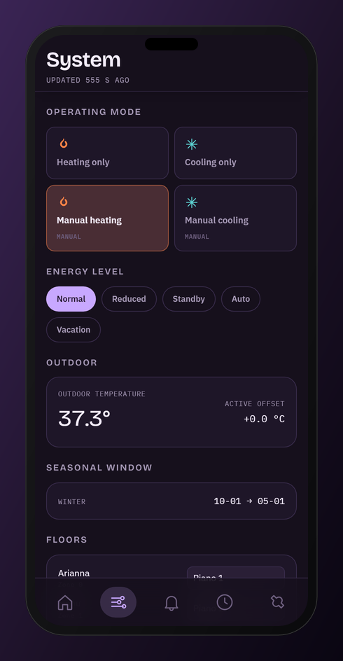<br/>
      <sub><b>System</b> — heating / cooling / manual tiles, energy-level pills (Normal · Reduced · Standby · Auto · Vacation), live outdoor temperature, and the active winter ↔ summer window.</sub>
    </td>
  </tr>
  <tr>
    <td align="center" width="50%">
      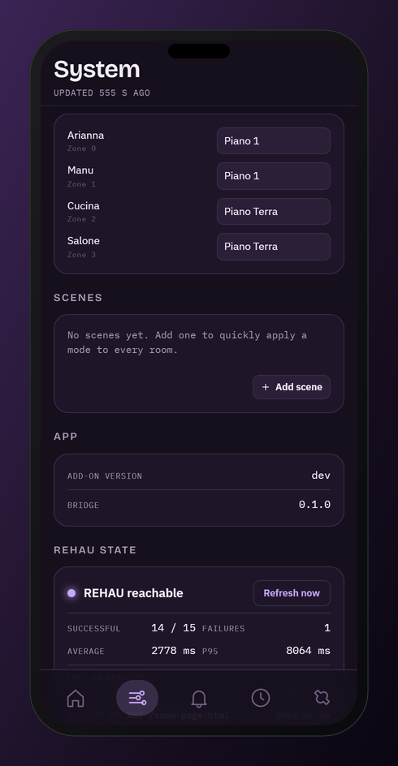<br/>
      <sub><b>Floors editor</b> — assign each room to a floor label. The Dashboard regroups (alphabetic) automatically; below the floors list sit the REHAU-state telemetry and app-version chips.</sub>
    </td>
    <td align="center" width="50%">
      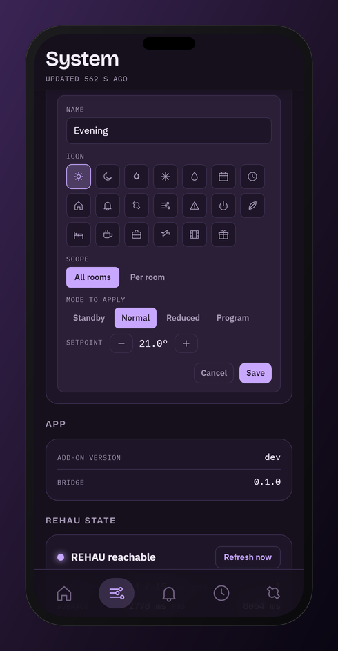<br/>
      <sub><b>Scene editor — global</b> — name, icon (twenty options), scope (All rooms / Per-room), the target mode and, for Normal / Reduced, a setpoint Stepper. Apply once → every room writes through the optimistic-write path.</sub>
    </td>
  </tr>
  <tr>
    <td align="center" width="50%">
      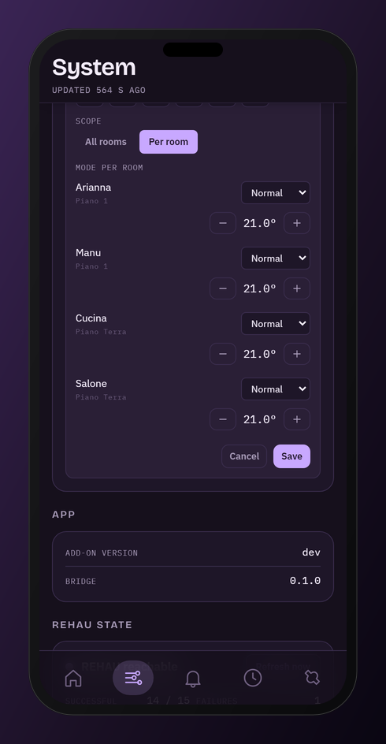<br/>
      <sub><b>Scene editor — per-room</b> — flip the Scope toggle and each room gets its own mode + setpoint pair. Rooms left on "Skip" stay untouched when the scene fires — useful for asymmetric night-time profiles.</sub>
    </td>
    <td align="center" width="50%">
      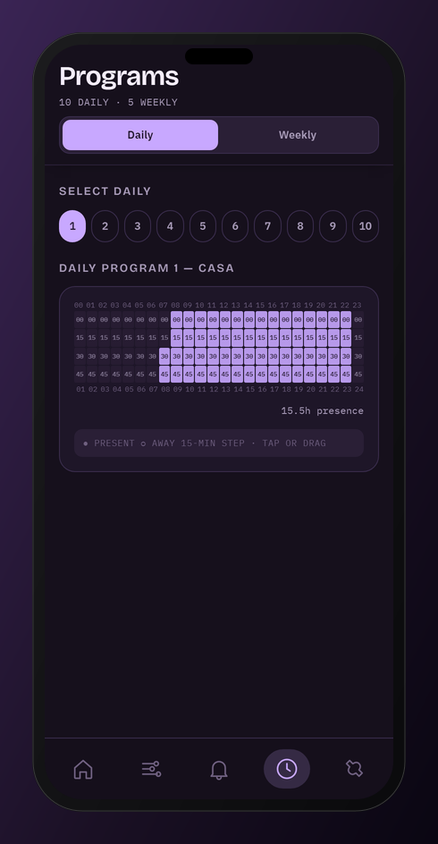<br/>
      <sub><b>Programs</b> — five weekly programs × ten daily slots, mirrored straight from the device. The slot picker is filled lazily — every slot is reachable, even ones REHAU's UI hides behind the dropdown.</sub>
    </td>
  </tr>
  <tr>
    <td align="center" width="50%">
      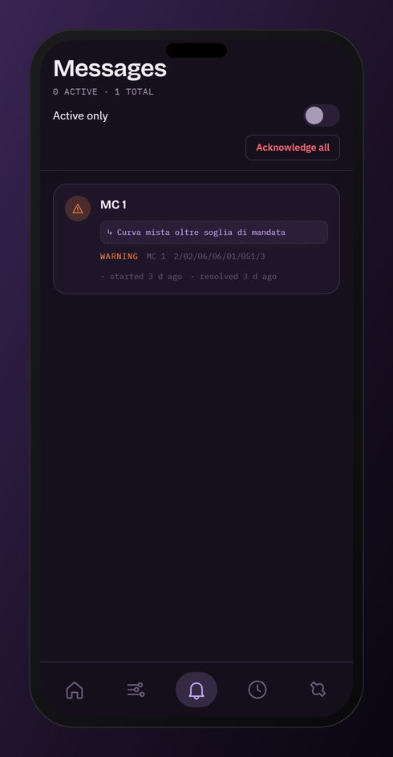<br/>
      <sub><b>Messages</b> — REHAU notification log: alarm code, source channel, start / resolved timestamps. "Active only" filter and a one-tap "Acknowledge all" that POSTs <code>MessagesHidden=</code> on the device.</sub>
    </td>
    <td align="center" width="50%">
      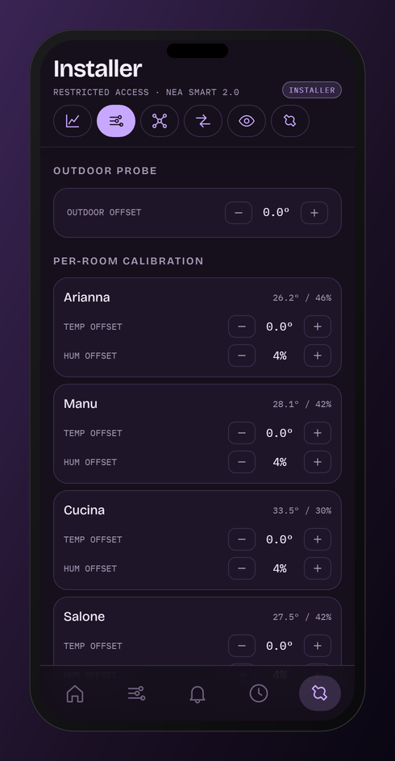<br/>
      <sub><b>Installer</b> — restricted-access section for users with the installer code. Six subtabs (Curve, Calibration, Bus, I/O, Diagnostics, Advanced) live behind a horizontally-scrolling icon strip. Edits batch behind one Save button so REHAU's all-or-nothing forms get a single round-trip.</sub>
    </td>
  </tr>
</table>

---

## Contents

| Add-on | Slug | What it does |
|---|---|---|
| [REHAU Nea Smart 2 Bridge (local)](./rehau-bridge) | `rehau_bridge_local` | Polls the base station, publishes HA MQTT discovery, serves a Web UI under ingress, exposes a REST API + Swagger. |

The add-on supports `amd64`, `aarch64` and `armv7` — i.e. every host HA
Supervisor runs on (Intel NUC, Raspberry Pi 4/5, ODROID, generic ARM SBC).

---

## What this does for you

- **One HA device per REHAU installation** — climate, sensor, switch and
  binary_sensor entities are auto-discovered. No YAML, no templates.
- **Per-room climate** with the right mode mapping (`standby`→`off`,
  `normal`/`reduced`→`heat`, `program`→`auto`) and preset support for
  REHAU's native modes.
- **Fancoil awareness** — speed and flap state are surfaced as diagnostic
  sensors, plus a `binary_sensor` that mirrors the pink "fan running"
  badge on the REHAU console.
- **Lock / Auto-start / Open-window detection** per room exposed as
  HA switches (config entity category) — wires straight to the
  `room-set-up.html` form on the device.
- **Calibration offsets** (outdoor probe + per-room temperature/humidity)
  visible as diagnostic sensors when `expose_calibration: true`.
- **Raw I/O** of master + every U-module (RZ, RELAY, DI, AI, AO) when
  `expose_io: true`, useful for power-user automations.
- **Web UI** (React SPA, dark/light theme, EN/IT) under HA ingress, also
  exposed directly on `http://<ha-host>:8080/` for fullscreen / PWA use.
- **Auto-login through HA ingress** — clicking the sidebar entry drops
  you straight into the dashboard, no password prompt.
- **Mobile-first**: PWA manifest, status-bar safe areas, scrollbars
  hidden, pinch zoom disabled, font scales with the OS text-size
  preference. Add to home screen → fullscreen app.

## How it works

```
                                           ┌────────────────────────────┐
                                           │  Home Assistant (Supervisor)│
                          HA add-on        │                            │
                       ┌──────────────────┐│   Mosquitto add-on (mqtt)  │
                       │                  ││             ▲              │
   LAN HTTP            │    Node.js       ││             │              │
   ┌───────────┐       │    Fastify       ││             │              │
   │           │ ◄───► │    + cheerio     ├┴─MQTT─►──────┘              │
   │ REHAU base│       │    + mqtt.js     │                             │
   │ station   │       │    + React SPA   ├──── HA Ingress ─► sidebar  │
   │           │       │                  │                             │
   └───────────┘       └──────┬───────────┘                             │
                              │                                         │
                              └────── REST + Swagger ─► port 8080 ──────┤
                                                                        │
                                                              Browser / │
                                                              PWA       │
                                                                        │
                                                          └─────────────┘
```

1. A poller scrapes the REHAU device's installer web UI on a tight
   schedule (rooms every 15 s, room details round-robin every 60 s, I/O
   every 10 s, messages every 5 min — all tunable).
2. State is normalised into a typed store; every change emits an event.
3. The MQTT bridge publishes retained state JSON per topic, plus HA
   discovery payloads (climate, sensor, switch, binary_sensor) so HA
   builds the device card automatically.
4. The Fastify server exposes a JSON REST API (`/api/v1/*`), a Swagger
   UI (`/docs`), and the bundled React SPA at `/`.

### Why local, not cloud

| | Local (this add-on) | Cloud-based (previous v5 line) |
|---|---|---|
| Latency | ~150 ms LAN round-trip | seconds — and a Playwright session has to be running |
| Auth | One installer code | E-mail account + password + 2FA via POP3 / OAuth2 |
| Rate limit | None (your device) | REHAU may throttle |
| Privacy | Nothing leaves the LAN | Your control state goes through REHAU's servers |
| Outage tolerance | Works if HA + REHAU on LAN | Breaks the moment REHAU has an outage |

The trade-off: local needs the **installer code** for the device (printed
on the box, sticker, or the unique code page on the device itself). Cloud
needed your REHAU MyHome account. Pick whichever fits your setup; you can
only run one at a time.

---

## Prerequisite — REHAU base station in AP mode

Before the add-on can talk to the device you need the REHAU Nea Smart 2.0
base station to be reachable over your LAN with its **local web
interface enabled** (the "AP / Access Point" setup mode in REHAU's
manual). The cloud-bound mode (linked to a REHAU account, accessed
only through the REHAU app) is **not** what we want.

If your installation is currently cloud-only, you'll need to:

1. Reset / re-pair the base station and choose the local / AP setup
   flow during commissioning (see the REHAU quick-start in the box).
2. Note the LAN IP the base station picks up via DHCP — that's the
   `device_url` you'll paste into the add-on.
3. Find the 8-character installer code on the device's *Unique Code*
   page (or the sticker / commissioning sheet). That's the
   `device_installer_code`.

> 📘 **A full step-by-step installation guide — including AP-mode
> setup, joining the HA host to the base station's Wi-Fi, and the
> first-time bridge configuration — lives in
> [`INSTALL.md`](INSTALL.md).** Start there if any of the above is
> unfamiliar; the *Quick start* below assumes the base station is
> already on your LAN with the local interface up.

## Quick start

1. **Add this repository** to your Home Assistant Supervisor:
   - Settings → Add-ons → Add-on Store → **⋮** (top right) → **Repositories**
   - Paste:
     `https://github.com/manuxio/rehau-nea-smart-2-home-assistant`
   - **Add** and close.

   *(Or click the **Add to Home Assistant** badge at the top of this README.)*

2. **Install** the *REHAU Nea Smart 2 Bridge (local)* add-on from the
   Add-on Store (you'll find it under the new repository, near the
   bottom of the page).

3. **Configure** — open the add-on, *Configuration* tab, and set at
   minimum:
   - `device_url` — e.g. `http://10.0.0.50` (the REHAU base station IP)
   - `device_installer_code` — the 8-character installer code from the
     REHAU device's *Unique Code* page
   - `installation_name` — a short label shown in HA and used to slug
     the MQTT topic path (e.g. `Casa`, `Office`, `Apartment-3F`)

   Leave the MQTT fields blank: if you have the **Mosquitto broker**
   add-on installed and active, the bridge auto-discovers it. Override
   only if you use an external broker.

4. **Start** the add-on. Within ~30 s you'll see:
   - one `climate.<installation>_<room>` entity per zone
   - `sensor.<installation>_<room>_humidity` per zone
   - `select.<installation>_operating_mode`, `_energy_level`
   - `binary_sensor.<installation>_alarms_active`
   - switches for room lock / auto-start / window detection, plus the
     room light when applicable
   - diagnostic sensors for fancoil running / fan speed / flap (rooms
     that have a fancoil assigned and active in the current system mode)
   - diagnostic binary_sensors / sensors for I/O channels (if
     `expose_io: true`)
   - diagnostic sensors for calibration offsets (if
     `expose_calibration: true`)

5. **Open the Web UI**:
   - Sidebar icon **REHAU** → opens inside HA via ingress (auto-login).
   - Or `http://<ha-host>:8080/` → fullscreen, PWA-installable.

---

## Configuration reference

All options live in the add-on's *Configuration* tab. Defaults shown.

| Key | Default | What |
|---|---|---|
| `device_url` | `http://10.0.0.1` | LAN URL of the REHAU base station |
| `device_installer_code` | *(empty)* | 8-char installer password, required |
| `installation_name` | `Casa` | Human-readable label, HA device name, MQTT topic slug |
| `device_request_timeout_ms` | `22000` | Per-request timeout against REHAU |
| `device_min_gap_ms` | `150` | Cool-down between consecutive REHAU calls — raise to 250-400 ms if you see ConnectTimeout |
| `api_user` / `api_password_hash` | `admin` / bcrypt of `admin123` | Web UI auth credentials |
| `jwt_secret` / `jwt_ttl` | auto / `30d` | Token signing secret and lifetime. Leave secret blank to auto-generate (persisted) |
| `admin_role` | `installer` | `user` or `installer` (gates the installer tabs in the UI) |
| `mqtt_url` / `mqtt_username` / `mqtt_password` | *(empty)* | Override MQTT broker; leave blank to use HA Mosquitto |
| `mqtt_base_topic` | `rehau` | Root MQTT topic — installation slug is appended (e.g. `rehau/casa/...`) |
| `mqtt_ha_discovery` | `true` | Publish HA MQTT discovery payloads |
| `mqtt_ha_discovery_prefix` | `homeassistant` | HA's discovery prefix; only change if your HA does |
| `poll_dashboard_s` / `poll_rooms_s` / `poll_room_detail_s` / `poll_messages_s` / `poll_io_s` | 30 / 15 / 60 / 300 / 10 | Polling intervals — lower = more responsive, more LAN traffic to REHAU |
| `expose_io` | `true` | Publish raw I/O diagnostics (keeps installer session open) |
| `expose_calibration` | `true` | Publish calibration offsets as diagnostic sensors |
| `room_floors` | *(empty)* | UI-only floor mapping, format `0:Floor 1,1:Floor 1,2:Ground floor` |
| `log_level` / `log_format` | `info` / `json` | `fatal/error/warn/info/debug/trace`, `json` or `pretty` |

---

## MQTT topic structure

```
<base>/<installation-slug>/<device-id>/
├── system/state                                # JSON
├── system/operating_mode/set                   # command topic
├── system/energy_level/set                     # command topic
├── messages                                    # JSON array
├── alarms/active                               # "true" | "false"
├── alarms/count                                # integer
├── io                                          # JSON snapshot
├── availability                                # "online" | "offline" (LWT)
└── rooms/<room-id>/
    ├── state                                   # full Room JSON
    ├── setpoint/set                            # float °C
    ├── mode/set                                # standby|normal|reduced|program
    ├── light/set                               # "true" | "false"
    ├── lock/set                                # "true" | "false"
    ├── auto_start/set                          # "true" | "false"
    └── window_detection/set                    # "true" | "false"
```

Example with `installation_name=Casa` and `device_id=27165454`:
`rehau/casa/27165454/rooms/r-arianna/state`

The slug-in-the-path lets multiple installations coexist on the same
broker without collisions.

---

## Web UI

The bundled React SPA lives at `/` and is also reachable behind HA
ingress (sidebar icon "REHAU"). Features:

- **Dashboard** — room cards with current temperature, setpoint, mode
  pill, program strip, fancoil status (icon spins when running), light
  state (icon glows when on).
- **System** — operating mode, energy level, outdoor temperature,
  seasonal window, device info, link to Swagger docs.
- **Messages** — REHAU alarms / events with active filter.
- **Programs** — visual editor for the 10 daily programs (15-min
  resolution, drag-to-paint) and the 5 weekly programs (per-day
  stepper).
- **Installer** (installer role only) — heat curve, calibration,
  bus topology, live I/O, diagnostics, and direct edit of every
  installer-page setting (curve / heat-cool / devices / functions /
  PID / fancoil).
- **Room detail** — radial setpoint dial, mode segmented control,
  per-room preferences (lock / auto-start / window detection),
  accessories (light, fancoil status, flap).
- Dark + light theme, EN + IT, OS-text-size aware, mobile/PWA optimised.

REST + SSE are mounted under `/api/v1/`; OpenAPI 3 spec at
`/openapi.json`, Swagger UI at `/docs`.

---

## Common issues

**The bridge starts but I see no rooms.**
The base station is unreachable. Check `device_url`, ping it from the
HA host, verify the LAN. The bridge logs the first failure with the
exact URL it tried.

**`ConnectTimeout` errors in the log.**
REHAU's TCP socket table is small; back-to-back requests can exhaust
TIME_WAIT. Raise `device_min_gap_ms` to `250` or `400`. The bridge
already enforces a cool-down + retry.

**MQTT entities not appearing in HA.**
Make sure the **Mosquitto** add-on is installed and started; the bridge
auto-discovers it. If you use an external broker, set `mqtt_url`
explicitly. Check the addon log for `mqtt connecting` and
`ha discovery published`.

**Web UI loads but every action fails with 401.**
Your JWT expired. Default TTL is 30 days — long enough for mobile PWA
use. Lower it via `jwt_ttl` if you want stricter sessions, or higher
(`365d`, `100y`) if you really never want re-login.

**Fancoil button doesn't appear for a room that has a fancoil.**
REHAU's installer page (`installer-room-set-up.html`) field `FanH`
must be `HC` or `Heating` for heating-only systems. The bridge only
shows what REHAU's UI shows; if you don't see the fancoil button on
the REHAU display either, fix `FanH` there first.

---

## Development

Source for the bridge + web UI is in a separate monorepo:
https://github.com/manuxio/rehau-nea-smart-2-api (private during dev,
public soon). This repo only ships the **packaged add-on**: pre-built
`dist/main.js` (tsup bundle) + pre-built React SPA, plus the HA
manifest, Dockerfile, and run script.

Releases bump `version` in `rehau-bridge/config.yaml`; HA's Add-on
Store shows an *Update* button when it differs from what's installed.

---

## License

MIT. See the linked source repo for full text. The bundled fonts
(IBM Plex Sans/Mono, Bricolage Grotesque) and the REHAU trademark
remain property of their owners.

REHAU® and Nea Smart® are trademarks of REHAU AG. This project is an
independent third-party integration, not affiliated with or endorsed
by REHAU.
