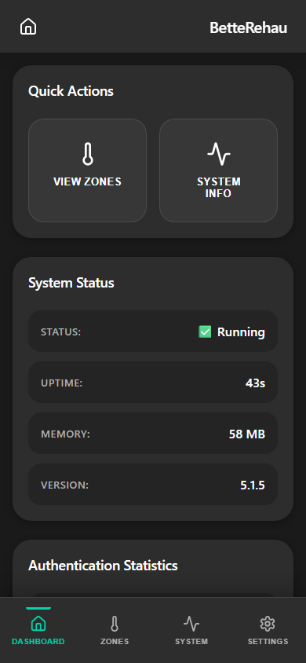
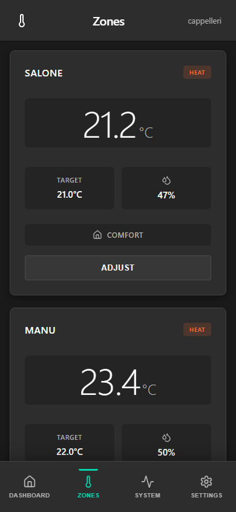
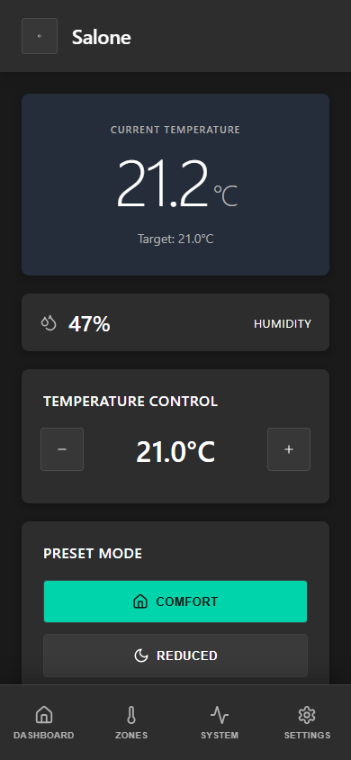
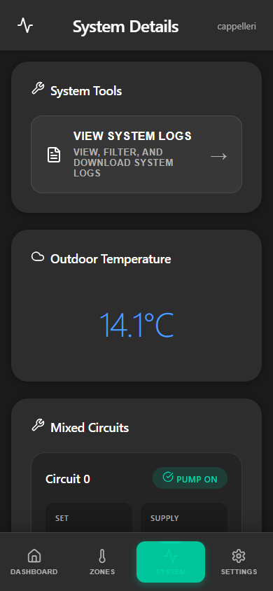
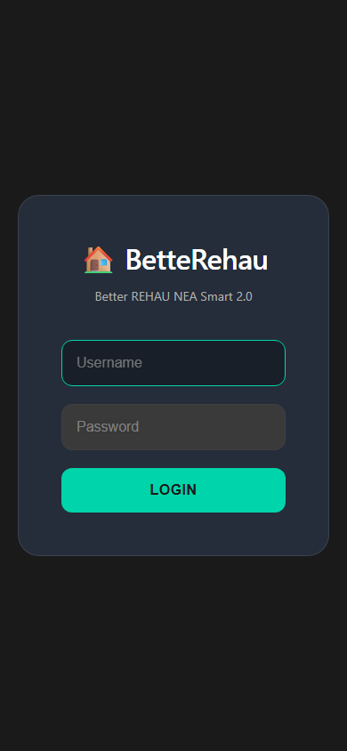

# REHAU NEA SMART 2.0 MQTT Bridge

<div align="center">


**Enterprise-grade MQTT bridge with modern web interface for REHAU NEA SMART 2.0 heating systems**

[Features](#-features) • [Installation](#-installation) • [Configuration](#-configuration) • [API Docs](#-api-documentation) • [Troubleshooting](#-troubleshooting)

</div>

---

## 📋 Table of Contents

- [Overview](#-overview)
- [Features](#-features)
- [Screenshots](#-screenshots)
- [Installation](#-installation)
- [Configuration](#-configuration)
- [API Documentation](#-api-documentation)
- [Web UI](#-web-ui)
- [Home Assistant Integration](#-home-assistant-integration)
- [Troubleshooting](#-troubleshooting)
- [Development](#-development)
- [Contributing](#-contributing)
- [License](#-license)

---

## 🎯 Overview

The REHAU NEA SMART 2.0 MQTT Bridge is a professional-grade integration solution that connects REHAU heating systems to Home Assistant and other MQTT-based platforms. Built with TypeScript and modern web technologies, it provides:

- **Real-time MQTT Bridge** - Bidirectional communication with REHAU cloud services
- **Modern Web UI** - Progressive Web App with mobile-first responsive design
- **REST API** - Complete programmatic access with OpenAPI/Swagger documentation
- **Automatic 2FA** - Seamless POP3-based email verification
- **Cloudflare Bypass** - Playwright-powered browser automation
- **Enterprise Features** - Monitoring, logging, health checks, and more

### Architecture

```
┌─────────────────┐      HTTPS/WSS      ┌──────────────┐
│  REHAU Cloud    │◄────────────────────┤  Playwright  │
│  (Cloudflare)   │                     │   Browser    │
└─────────────────┘                     └──────┬───────┘
                                               │
                                        ┌──────▼───────┐
                                        │  MQTT Bridge │
                                        │  (Node.js)   │
                                        └──────┬───────┘
                                               │
                    ┌──────────────────────────┼──────────────────────────┐
                    │                          │                          │
             ┌──────▼───────┐          ┌──────▼───────┐          ┌──────▼───────┐
             │  MQTT Broker │          │   REST API   │          │   Web UI     │
             │ (Mosquitto)  │          │  (Express)   │          │   (React)    │
             └──────┬───────┘          └──────────────┘          └──────────────┘
                    │
             ┌──────▼───────┐
             │Home Assistant│
             │  (MQTT Auto  │
             │   Discovery) │
             └──────────────┘
```

---

## ✨ Features

### Core Functionality

#### MQTT Bridge
- ✅ **Real-time Synchronization** - Instant updates via MQTT protocol
- ✅ **Bidirectional Communication** - Read and control all zones
- ✅ **Automatic Reconnection** - Resilient connection management
- ✅ **QoS Support** - Reliable message delivery
- ✅ **Retained Messages** - State persistence across restarts

#### Authentication & Security
- ✅ **Automatic 2FA** - POP3-based email verification code extraction
- ✅ **Token Management** - Automatic refresh every 6 hours
- ✅ **Cloudflare Bypass** - Playwright browser automation
- ✅ **OAuth2 Support** - Gmail and Outlook integration (experimental)
- ✅ **JWT Authentication** - Secure API access
- ✅ **Password Hashing** - bcrypt-based credential storage

#### Web Interface
- 📱 **Progressive Web App** - Install on any device
- 🎨 **Modern Design** - Material-inspired responsive UI
- 🌓 **Dark Mode** - Automatic theme switching
- 📊 **Real-time Dashboard** - Live system monitoring
- 🔐 **Secure Login** - JWT-based authentication
- 📱 **Mobile Optimized** - Touch-friendly controls
- 🔄 **Pull-to-Refresh** - Native mobile gestures
- 📴 **Offline Support** - Service worker caching

#### REST API
- 🔌 **OpenAPI 3.0** - Complete Swagger documentation
- 🔐 **Bearer Authentication** - JWT token-based access
- 📊 **System Status** - Health checks and diagnostics
- 🏠 **Installation Management** - Full CRUD operations
- 🌡️ **Zone Control** - Temperature and mode management
- 📝 **Log Export** - Obfuscated log downloads
- 📈 **Statistics** - Usage and performance metrics

#### Monitoring & Diagnostics
- 🔍 **Staleness Detection** - Automatic data freshness monitoring
- 📈 **Resource Monitoring** - CPU and memory tracking
- 📝 **Enhanced Logging** - Structured, obfuscated logs
- 🏥 **Health Checks** - System diagnostics endpoint
- 📊 **Performance Metrics** - Response time tracking
- 🔔 **Alert System** - Configurable notifications

#### Advanced Features
- 🔄 **Data Validation** - Schema-based input validation
- 🗄️ **State Management** - Persistent zone states
- 🔌 **Plugin Architecture** - Extensible design
- 🌐 **Multi-language** - Internationalization ready
- 📦 **Docker Support** - Production-ready containers
- 🚀 **Auto-scaling** - Horizontal scaling support

---

## 📸 Screenshots

### Mobile Web UI (iPhone 14 Pro)

<div align="center">

#### Dashboard


*Real-time system overview with status indicators and quick stats*

#### Zones List


*All heating zones with current temperature and status*

#### Zone Detail


*Detailed zone control with temperature adjustment and mode selection*

#### System Status


*System diagnostics, resource usage, and configuration*

#### Login


*Secure authentication with modern design*

</div>

---

## 🚀 Installation

### Prerequisites

- **Node.js** 20.x or higher
- **MQTT Broker** (Mosquitto recommended)
- **REHAU Account** with NEA SMART 2.0 system
- **POP3 Email** for 2FA automation (GMX.de recommended)

### Option 1: Home Assistant Add-on (Recommended)

1. **Add Repository**
   ```
   https://github.com/manuxio/rehau-nea-smart-2-home-assistant
   ```

2. **Install Add-on**
   - Settings → Add-ons → Add-on Store
   - Search for "REHAU NEA SMART 2.0"
   - Click Install

3. **Configure** (see [Configuration](#-configuration))

4. **Start**
   - Enable "Start on boot"
   - Enable "Watchdog"
   - Click Start

### Option 2: Docker

```bash
# Pull image
docker pull ghcr.io/manuxio/rehau-nea-smart-2-home-assistant:latest

# Run container
docker run -d \
  --name rehau-bridge \
  --restart unless-stopped \
  -p 3000:3000 \
  -e REHAU_EMAIL=your@email.com \
  -e REHAU_PASSWORD=your_password \
  -e POP3_EMAIL=your@gmx.de \
  -e POP3_PASSWORD=pop3_password \
  -e POP3_HOST=pop.gmx.net \
  -e POP3_PORT=995 \
  -e POP3_SECURE=true \
  -e MQTT_HOST=mqtt-broker \
  -e MQTT_PORT=1883 \
  -e MQTT_USERNAME=mqtt_user \
  -e MQTT_PASSWORD=mqtt_pass \
  -e API_PASSWORD=secure_password \
  ghcr.io/manuxio/rehau-nea-smart-2-home-assistant:latest
```

### Option 3: Docker Compose

```yaml
version: '3.8'

services:
  rehau-bridge:
    image: ghcr.io/manuxio/rehau-nea-smart-2-home-assistant:latest
    container_name: rehau-bridge
    restart: unless-stopped
    ports:
      - "3000:3000"
    environment:
      # REHAU Credentials
      REHAU_EMAIL: your@email.com
      REHAU_PASSWORD: your_password
      
      # POP3 Configuration (for 2FA)
      POP3_EMAIL: your@gmx.de
      POP3_PASSWORD: pop3_password
      POP3_HOST: pop.gmx.net
      POP3_PORT: 995
      POP3_SECURE: true
      
      # MQTT Configuration
      MQTT_HOST: mosquitto
      MQTT_PORT: 1883
      MQTT_USERNAME: mqtt_user
      MQTT_PASSWORD: mqtt_pass
      
      # API Configuration
      API_ENABLED: true
      API_PASSWORD: secure_password
      WEB_UI_ENABLED: true
      
      # Logging
      LOG_LEVEL: info
    depends_on:
      - mosquitto

  mosquitto:
    image: eclipse-mosquitto:latest
    container_name: mosquitto
    restart: unless-stopped
    ports:
      - "1883:1883"
    volumes:
      - ./mosquitto/config:/mosquitto/config
      - ./mosquitto/data:/mosquitto/data
      - ./mosquitto/log:/mosquitto/log
```

### Option 4: Standalone

```bash
# Clone repository
git clone https://github.com/manuxio/rehau-nea-smart-2-home-assistant.git
cd rehau-nea-smart-2-home-assistant/rehau-nea-smart-mqtt-bridge

# Install dependencies
npm install

# Configure
cp .env.example .env
# Edit .env with your credentials

# Build
npm run build

# Start
npm start
```

---

## ⚙️ Configuration

### Required Settings

#### REHAU Credentials
```env
REHAU_EMAIL=your.email@example.com
REHAU_PASSWORD=your_rehau_password
```

#### POP3 Email (for 2FA)
```env
POP3_EMAIL=your.email@gmx.de
POP3_PASSWORD=your_pop3_password
POP3_HOST=pop.gmx.net
POP3_PORT=995
POP3_SECURE=true
```

**Recommended Provider**: [GMX.de](https://www.gmx.de) (free, German, reliable POP3)

**Setup Steps**:
1. Create GMX account
2. Enable POP3 in settings
3. Forward emails from `noreply@accounts.rehau.com` to GMX
4. Use GMX credentials above

#### MQTT Broker
```env
MQTT_HOST=localhost
MQTT_PORT=1883
MQTT_USERNAME=mqtt_user        # Optional
MQTT_PASSWORD=mqtt_password    # Optional
```

#### API Access
```env
API_ENABLED=true
API_PASSWORD=your_secure_password
WEB_UI_ENABLED=true
```

### Optional Settings

#### Logging
```env
LOG_LEVEL=info                 # debug, info, warn, error
LOG_SHOW_OK_REQUESTS=false     # Show successful HTTP requests
LOG_OBFUSCATE=true             # Mask sensitive data
```

#### Playwright
```env
PLAYWRIGHT_HEADLESS=true       # Run browser in headless mode
PLAYWRIGHT_IDLE_TIMEOUT=60000  # Browser idle timeout (ms)
```

#### Token Management
```env
TOKEN_REFRESH_INTERVAL=21600   # Refresh interval (seconds, default 6h)
FORCE_FRESH_LOGIN=false        # Force new login instead of refresh
```

#### Monitoring
```env
STALENESS_WARNING_MS=600000    # Warn after 10 minutes
STALENESS_STALE_MS=1800000     # Stale after 30 minutes
LIVE_DATA_INTERVAL=300         # Poll installation data every 5 minutes
```

#### Advanced
```env
MQTT_TOPIC_PREFIX=rehau        # MQTT topic prefix
MQTT_CLIENT_ID=rehau-bridge    # MQTT client identifier
API_PORT=3000                  # API server port
API_USERNAME=admin             # API username (default: admin)
```

### OAuth2 Configuration (Experimental)

For Gmail or Outlook POP3 access:

```env
POP3_PROVIDER=gmail            # or 'outlook'
POP3_OAUTH2_CLIENT_ID=your_client_id
POP3_OAUTH2_CLIENT_SECRET=your_client_secret
POP3_OAUTH2_REFRESH_TOKEN=your_refresh_token
POP3_OAUTH2_TENANT_ID=your_tenant_id  # Outlook only
```

See [OAuth2 Setup Guides](./docs/oauth2-setup.md) for detailed instructions.

---

## 📡 API Documentation

### Swagger UI

Access interactive API documentation at:
```
http://localhost:3000/api-docs
```

### Authentication

All API endpoints (except `/health`) require JWT authentication:

```bash
# Login
curl -X POST http://localhost:3000/api/v1/auth/login \
  -H "Content-Type: application/json" \
  -d '{"username":"admin","password":"your_password"}'

# Response
{
  "token": "eyJhbGciOiJIUzI1NiIsInR5cCI6IkpXVCJ9...",
  "expiresIn": "24h"
}

# Use token in subsequent requests
curl -H "Authorization: Bearer YOUR_TOKEN" \
  http://localhost:3000/api/v1/status/system
```

### Key Endpoints

#### System Status
```bash
GET /api/v1/status/system
```

#### Installations
```bash
GET /api/v1/installations
GET /api/v1/installations/:id
```

#### Zones
```bash
GET /api/v1/zones
GET /api/v1/zones/:id
POST /api/v1/zones/:id/temperature
POST /api/v1/zones/:id/mode
```

#### Logs
```bash
GET /api/v1/logs
GET /api/v1/logs/export?mode=shareable
```

#### Configuration
```bash
GET /api/v1/config
```

---

## 🌐 Web UI

### Access

- **URL**: `http://localhost:3000`
- **Default Credentials**: `admin` / (your API_PASSWORD)

### Features

- **Dashboard** - System overview and quick stats
- **Zones** - All heating zones with real-time data
- **Zone Control** - Temperature adjustment and mode selection
- **System** - Diagnostics, logs, and configuration
- **Settings** - User preferences and about information

### Progressive Web App

Install as a native app on any device:

**iOS (Safari)**:
1. Open in Safari
2. Tap Share → Add to Home Screen

**Android (Chrome)**:
1. Open in Chrome
2. Tap Menu → Install app

**Desktop (Chrome/Edge)**:
1. Click install icon in address bar
2. Click Install

---

## 🏠 Home Assistant Integration

### Auto-Discovery

The bridge automatically creates MQTT discovery entities:

#### Climate Entities
```yaml
climate.rehau_living_room:
  current_temperature: 21.5
  target_temperature: 22.0
  hvac_mode: heat
  preset_mode: comfort
  hvac_modes: [heat, cool, off]
  preset_modes: [comfort, eco, away, home]
```

#### Sensors
- `sensor.rehau_bridge_status` - Connection status
- `sensor.rehau_auth_status` - Authentication state
- `sensor.rehau_outside_temperature` - Outdoor temperature
- `sensor.rehau_zone_*_humidity` - Zone humidity

#### Binary Sensors
- `binary_sensor.rehau_zone_*_stale` - Data freshness

### Example Automations

**Night Mode**:
```yaml
automation:
  - alias: "REHAU Night Mode"
    trigger:
      platform: time
      at: "22:00:00"
    action:
      service: climate.set_preset_mode
      target:
        entity_id: climate.rehau_bedroom
      data:
        preset_mode: eco
```

---

## 🔧 Troubleshooting

### Authentication Issues

**Problem**: Authentication fails
```
✓ Verify REHAU credentials
✓ Check POP3 configuration
✓ Ensure email forwarding is active
✓ Enable LOG_LEVEL=debug
✓ Check for 2FA emails in POP3 account
```

### MQTT Issues

**Problem**: MQTT connection fails
```
✓ Verify broker is running
✓ Check MQTT_HOST and MQTT_PORT
✓ Test with mosquitto_pub/sub
✓ Verify credentials if auth enabled
✓ Check firewall rules
```

### Playwright Issues

**Problem**: Browser launch fails
```
✓ Ensure Chromium dependencies installed
✓ Increase memory allocation (4GB recommended)
✓ Set PLAYWRIGHT_HEADLESS=true
✓ Check system resources
```

### Data Staleness

**Problem**: Zone data not updating
```
✓ Check staleness sensors
✓ Verify MQTT connection quality
✓ Review authentication status
✓ Check LIVE_DATA_INTERVAL setting
✓ Manually trigger refresh via API
```

### Debug Mode

Enable detailed logging:
```env
LOG_LEVEL=debug
LOG_SHOW_OK_REQUESTS=true
```

View logs:
```bash
# Docker
docker logs rehau-bridge -f

# Standalone
npm start
```

---

## 👨‍💻 Development

### Setup

```bash
git clone https://github.com/manuxio/rehau-nea-smart-2-home-assistant.git
cd rehau-nea-smart-2-home-assistant/rehau-nea-smart-mqtt-bridge

npm install
cp .env.example .env
# Edit .env

npm run dev
```

### Scripts

```bash
npm run build          # Build backend + web UI
npm run build:backend  # Build TypeScript
npm run build:web-ui   # Build React app
npm start              # Start production server
npm run dev            # Start development server
npm test               # Run tests
npm run release:patch  # Bump patch version
npm run release:minor  # Bump minor version
npm run release:major  # Bump major version
```

### Project Structure

```
rehau-nea-smart-mqtt-bridge/
├── src/
│   ├── api/              # REST API routes and middleware
│   ├── auth/             # OAuth2 providers
│   ├── ha-integration/   # Home Assistant integration
│   ├── logging/          # Enhanced logging system
│   ├── monitoring/       # Resource and staleness monitoring
│   ├── parsers/          # REHAU data parsers
│   ├── climate-controller.ts
│   ├── index.ts
│   ├── mqtt-bridge.ts
│   ├── playwright-https-client.ts
│   ├── pop3-client.ts
│   └── rehau-auth.ts
├── web-ui/
│   ├── src/
│   │   ├── api/          # API client
│   │   ├── components/   # React components
│   │   ├── contexts/     # React contexts
│   │   ├── hooks/        # Custom hooks
│   │   ├── pages/        # Page components
│   │   └── store/        # Zustand state management
│   └── public/
├── docs/                 # Documentation
├── scripts/              # Build and release scripts
└── tests/                # Test files
```

---

## 🤝 Contributing

Contributions welcome! Please:

1. Fork the repository
2. Create a feature branch
3. Make your changes
4. Add tests if applicable
5. Submit a pull request

### Code Style

- **TypeScript** with strict mode
- **ESLint** for linting
- **Prettier** for formatting
- **Conventional Commits** for commit messages

---

## 📄 License

MIT License - See [LICENSE](../LICENSE) for details.

---

## 🙏 Acknowledgments

### Sponsors

This project is proudly sponsored by **[DomoDreams.it](https://domodreams.it)** - Your trusted partner for smart home solutions.

### Contributors

- **REHAU** for the NEA SMART 2.0 system
- **Home Assistant** community
- **Playwright** team
- **React** and **TypeScript** communities
- All contributors and users

---

<div align="center">

**Version 5.1.5** | **Made with ❤️ for Home Assistant**

[⬆ Back to Top](#rehau-nea-smart-20-mqtt-bridge)

</div>
